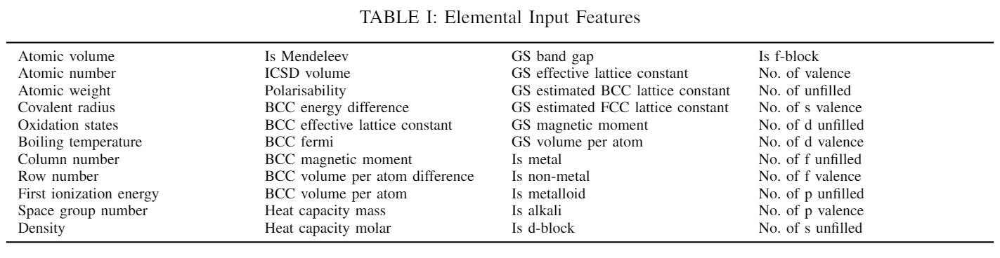
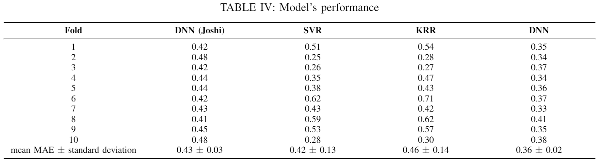

# Machine Learning for Battery Electrodes Voltage Prediction
In this project, the objective is to use supervised machine learning to train a model that is able to predict the electrodes voltage of novel/theoretical electrodes that has yet to been researched in depth. A robust model with good test performance can be used to shortlist top candidates of potentially good electrodes to efficiently focus research efforts on.

## Training and Test Data

Training data is obtained from [The Materials Project](https://materialsproject.org/) using the Materials API (MAPI), which is an open API for accessing Materials Project data based on REpresentational State Transfer (REST) principles. In particular, the Python wrapper, [Python Materials Genomics](https://github.com/materialsproject/pymatgen) (pymatgen), is used. In addition, [Xenonpy](https://github.com/yoshida-lab/XenonPy) is also used to supplement the training data given that is also has an interface to public materials databases. The input features used input features of the chemical compound generally fall into 4 distinct categories: 

1. Stoichiometric attributes 
2. Elemental property statistics 
3. Electronic structure attributes 
4. Ionic compound attributes

Table I above shows all the input features used. The training data is obtained from all the experimentally established battery electrodes data in the [The Materials Project](https://materialsproject.org/). The test data is obtained from the selected experimental data from the work of [Joshi et al.](https://pubs.acs.org/doi/10.1021/acsami.9b04933) The [`get_battery_data.ipynb`](https://github.com/mion666459/battery_electrode_ml/blob/main/get_battery_data.ipynb) contains the necessary codes to generate the [train](https://github.com/mion666459/battery_electrode_ml/blob/main/data/train/battery_dataset.csv) and [test](https://github.com/mion666459/battery_electrode_ml/blob/main/data/test/experimental_electrodes_data.csv) data. 

## Results

Table IV below shows the Mean Absolute Error of the model (DNN) in comparison with other ML based works from [Joshi et al.](https://pubs.acs.org/doi/10.1021/acsami.9b04933). Further details of the work can be found in the [battery_electrode_ml_report](https://github.com/mion666459/battery_electrode_ml/blob/main/battery_electrode_ml_report.pdf). 

